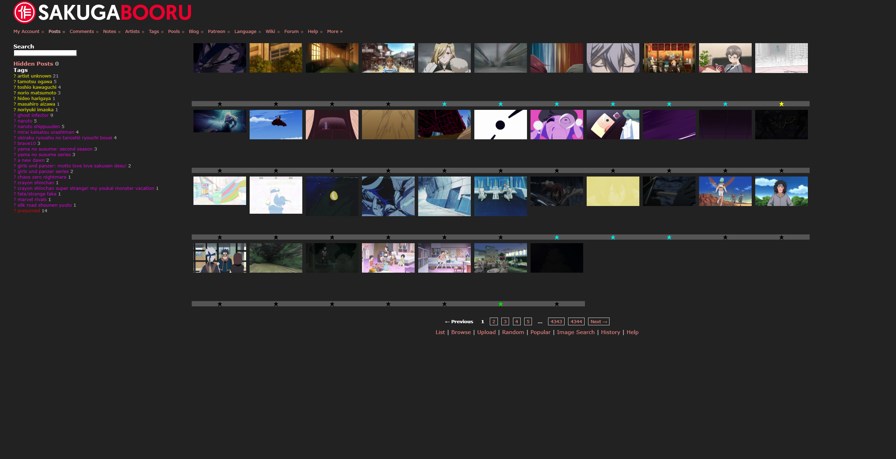
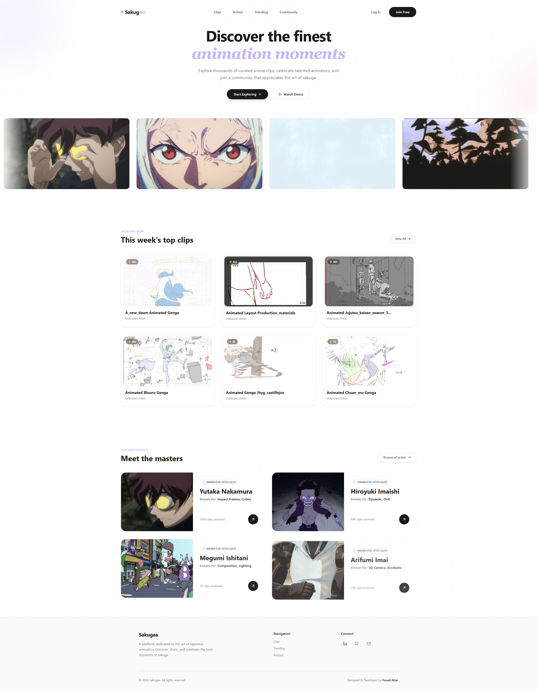

# Sakugaa

Interface moderne pour Sakugabooru — disponible sur **[sakugaa.com](https://sakugaa.com)**

---

## Contexte

[Sakugabooru](https://sakugabooru.com) est la référence pour découvrir les meilleurs moments d'animation anime (作画 — *sakuga*). La base de données est excellente, le design beaucoup moins. Sakugaa est une tentative de lui donner l'interface qu'il mérite.

| Sakugabooru | Sakugaa |
|-------------|---------|
|  |  |

---

## Stack

- **Next.js** (App Router) + TypeScript
- **Tailwind CSS**
- **Sakugabooru REST API**
- **Cloudflare Pages** — domaine custom `sakugaa.com`

---

## Roadmap

- [ ] Système de favoris
- [ ] Filtres avancés par animateur / studio
- [ ] Page artiste avec stats
- [ ] Mode sombre / clair
- [ ] Features exclusives absentes de Sakugabooru

---

## Auteur

**Foued Attar**  
[GitHub](https://github.com/Foued-pro) · [sakugaa.com](https://sakugaa.com)